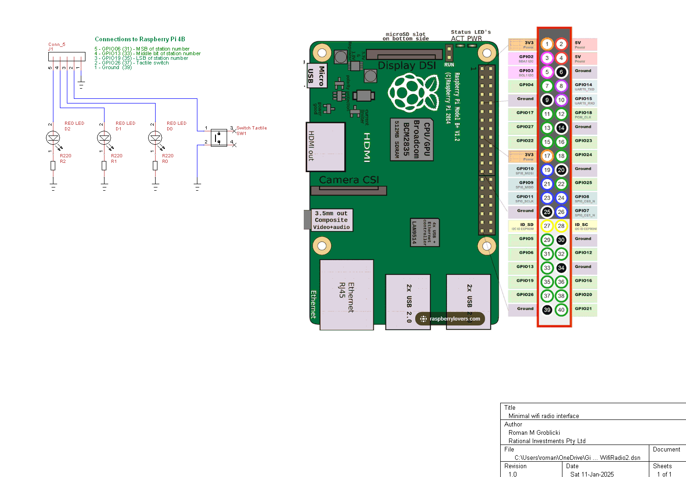
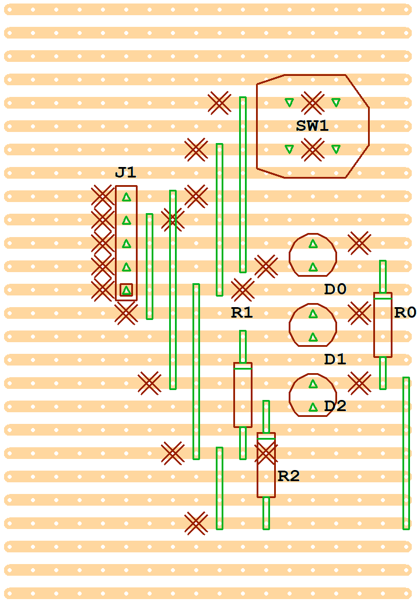
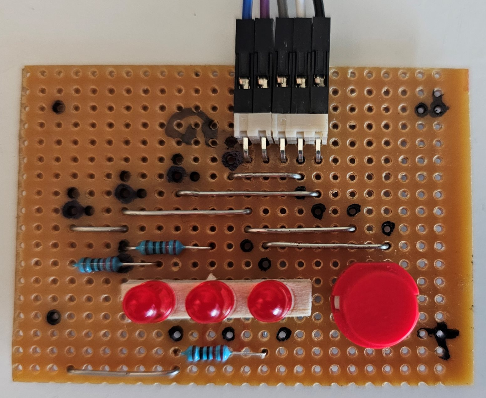
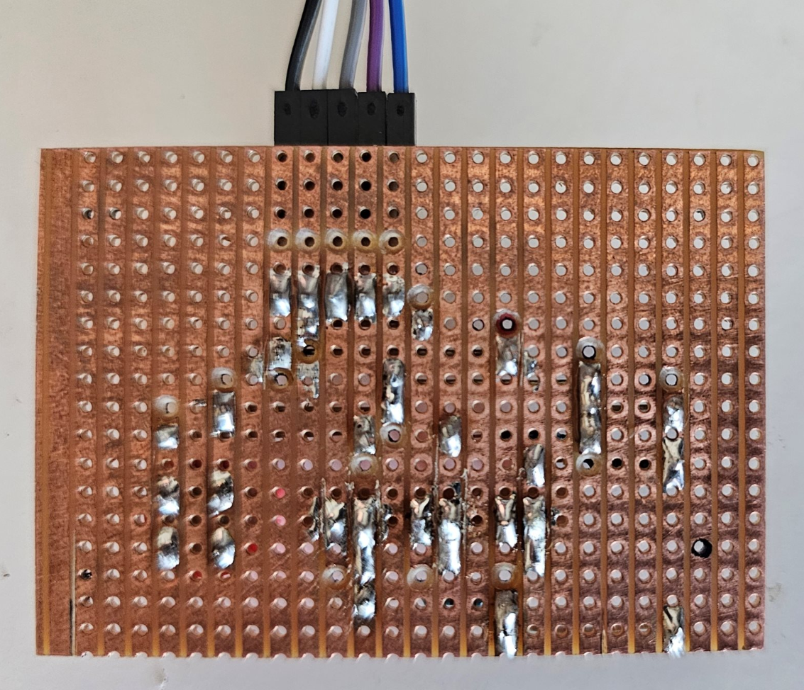

# Internet Radio

Here we describe the design, construction, programming and operation of an internet radio with a minimal one button interface based on a Raspberry Pi.

There are 7 available radio stations. One scrolls through them by successively pressing the tactile switch. Which number station is selected is diplayed in binary by three red LEDs. When all three LEDs are off then no station is playing. When the radio is turned off (ie. it is powered off) the currently streaming station is saved so that when the radio is powered on later that station resumes streaming.

The TinyCad design file [WifiRadio2.dsn](WifiRadio2.dsn) for the interface circuitry is displayed below:

The resulting VeeCad file [WifiRadio2.per](WifiRadio2.per) is displayed below:

It is obtained from the Netlist file [WifiRadio2.net](WifiRadio2.net) generated from WifiRadio2.dsn (displayed above).

This is what the completed interface board looks like:

The interface circuit is placed in a custom 3D printed enclosure which is secured on top of the case that houses the Raspberry Pi. 5 wires connect the interface circuit to the Raspberry Pi. This is the internet radio to which stereo USB powered 3.5m audio speakers must be attached.

The radio is implemented in software by a python script [Radio5.py](Radio5.py) that auto starts through the Python IDLE shell when the the GUI becomes active. The audio streaming uses cvlc. A valid wifi connection is assumed to be available and automatically enabled when the Raspberry Pi is powered on.

ENJOY!

