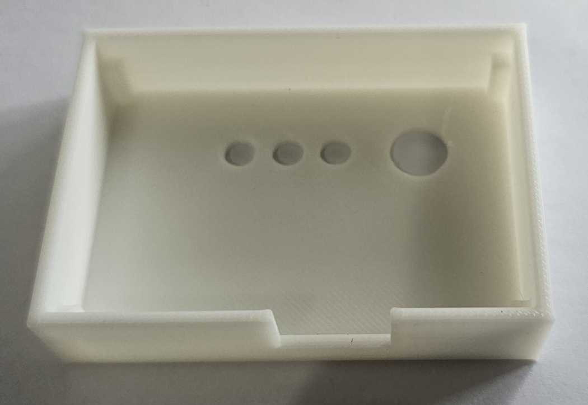
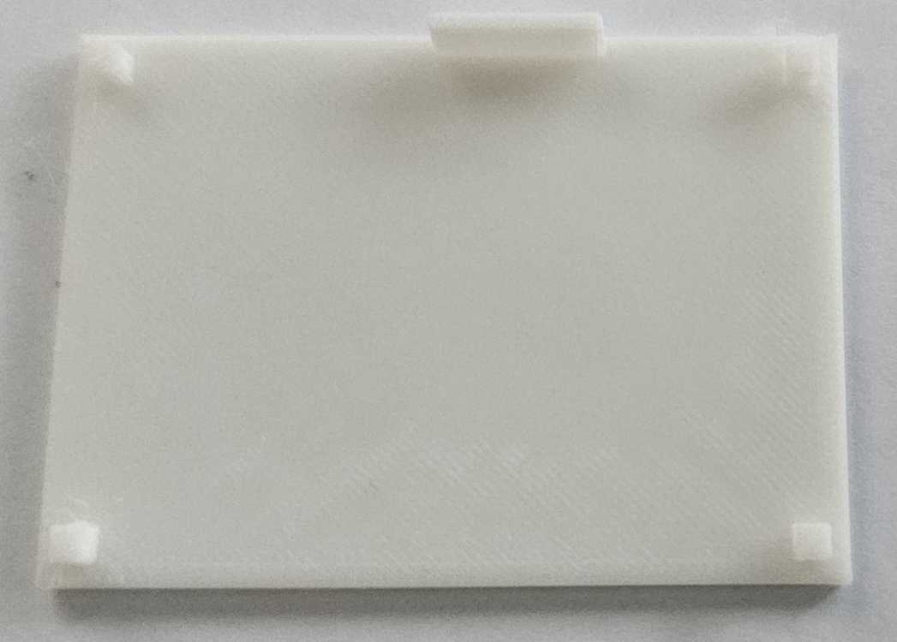
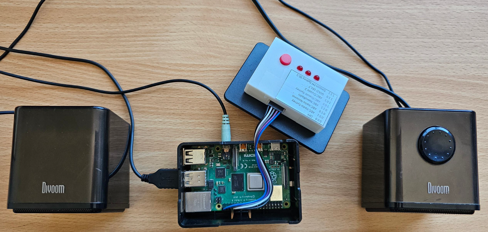

# Internet Radio

Here we describe the design, construction, programming and operation of an internet radio with a minimal one button interface based on a Raspberry Pi.

There are 7 available radio stations. One scrolls through them by successively pressing the tactile switch. The station number selected is diplayed in binary by three red 5mm LEDs. When all three LEDs are off then no station is playing (number 0). When the radio is powered off (by removing power to the Raspberry Pi) the currently streaming station is saved so that when the radio is powered on later that station resumes streaming.

## Physical design

The TinyCad design file [WifiRadio2.dsn](WifiRadio2.dsn) for the interface circuitry is displayed below:


The resulting VeeCad file [WifiRadio2.per](WifiRadio2.per) is displayed below:

It is obtained from the Netlist file [WifiRadio2.net](WifiRadio2.net) generated from WifiRadio2.dsn (displayed above).


This is what the completed interface board looks like:

Note that the LEDs are offset from the circuit board by 5mm using an appropriate piece of balsawood.


## Enclosure

The interface circuit is placed in a custom 3D printed enclosure which is secured on top of the case that houses the Raspberry Pi. 5 wires connect the interface circuit to the Raspberry Pi. This is the internet radio to which stereo USB powered 3.5m audio speakers must be attached (to the underlying Raspberry Pi).





The case was designed using Blender.

The top of the case is in [WifiRadio2_BoxTop.blend](WifiRadio2_BoxTop.blend), while the bottom is in [WifiRadio2_BoxBottom.blend](WifiRadio2_BoxBottom.blend). To view or edit these files open them with the Blender 4.3 App in Windows 11.

To be able to 3D print the enclosure these files must be exported from the Blender App as [WifiRadio2_BoxTop.stl](WifiRadio2_BoxTop.stl) and [WifiRadio2_BoxBottom.stl](WifiRadio2_BoxBottom.stl) respectively.

Finally these *.stl files must be opened into the Crealty Print 6.0 Windows 11 App which creates the [WifiRadio2_BoxTop.3mf](WifiRadio2_BoxTop.3mf) and [WifiRadio2_BoxBottom.3mf](WifiRadio2_BoxBottom.3mfl) respectively. These contain the type of printer needed and other details of the print and are the basis for creating (by File => Export => Export Gcode...) the *.gcode files [WifiRadio2_BoxTop.gcode](WifiRadio2_BoxTop.gcode) and [WifiRadio2_BoxBottom.gcode](WifiRadio2_BoxBottom.gcode) respectively. These are the actual files used by the 3D Printer to do the actual printing! The files saved here are for the Crealty Ender-3 V3 SE printer with default setting for Hyper PLA.

If you have a different 3D printer you can still use the *.stl files but you will have to generate the *.gcode files yourself.

## Raspberry Pi setup

I have used a Raspberry Pi Model B Rev1.2 with 4Gb RAM, running Raspbian GNU/Linux 12 (bookworm) on a 32Gb SD card.
It is configured to Boot To Desktop with Auto login, with only the Remote GPIO enabled.

Install Python3 and idle3 as well as vlc, all of which reside in the directory /usr/bin/.
In the directory /home/{username}/.config/autostart/ create a file autovlc.desktop with the contents:

```terminal
[Desktop Entry]
Type=Application
Exec=/usr/bin/idle -r /home/roman/GitHub/WifiRadio2/Radio5.py
```

This way of running the script via autostart in the GUI is because I tried to run it after boot in the Command Line Interface (CLI), however I could not make this work due to some privilage issues which made vlc unable to execute. This would have been more efficient and elegant but I just wanted to make it work.

In the directory /home/{username}/GitHub/WifiRadio2/ which you need to create place the python script Radio5.py detailed below. You will also need to make the Wifi network automatically connect to an available access point, by discovering it and putting its password. if you move the location of this internet radio you will need to setup anothwer wifi connection by accesing the Raspbewrry Pi's GUI with an attached mouse, keyboard and screen. 

## Software

The radio is implemented in software by a python script [Radio5.py](Radio5.py) that auto starts through the Python IDLE shell when the the GUI becomes active. The audio streaming uses cvlc. A valid wifi connection is assumed to be available and automatically enabled when the Raspberry Pi is powered on.

```python
import subprocess
import time
import RPi.GPIO as GPIO
import os;    

# Get the directory where the script is located
script_directory = os.path.dirname(os.path.abspath(__file__))

# Create the full filepath to the saved radio station file
filename = 'savedRadioStation.txt'
filepath = os.path.join(script_directory, filename)
print(f'The file {filepath} stores the last streamed station number.')

# Use BCM GPIO numbering 
GPIO.setmode(GPIO.BCM)

# Define Raspberry Pi pins that go to the interface circuit board
button_pin = 26
led0_pin = 19
led1_pin = 13
led2_pin = 6

# Setup the pins
GPIO.setup(button_pin, GPIO.IN, pull_up_down=GPIO.PUD_UP)
GPIO.setwarnings(False)
GPIO.setup(led0_pin, GPIO.OUT)
GPIO.setup(led1_pin, GPIO.OUT)
GPIO.setup(led2_pin, GPIO.OUT)

# setup the leds to be initially all off
GPIO.output(led0_pin,GPIO.LOW)
GPIO.output(led1_pin,GPIO.LOW)
GPIO.output(led2_pin,GPIO.LOW)

# 2D array of radio station information in [short name, long name, url] format
aStation = [
    ["2LRW","ABC Radio Sydney","https://live-radio01.mediahubaustralia.com/2LRW/mp3/"],
    ["5LRW","ABC Radio National","https://live-radio01.mediahubaustralia.com/2RNW/mp3/"],
    ["PBW","ABC NewsRadio","https://live-radio01.mediahubaustralia.com/PBW/mp3/"],
    ["2FMW","ABC Classic Sydney","https://live-radio01.mediahubaustralia.com/2FMW/mp3/"],
    ["FM2W","ABC Classic 2","https://live-radio01.mediahubaustralia.com/FM2W/mp3/"],
    ["WSFM","GOLD 101.7","https://playerservices.streamtheworld.com/api/livestream-redirect/ARN_WSFM.mp3"],
    ["SMOOTH953","Smooth FM Sydney 95.3","https://playerservices.streamtheworld.com/api/livestream-redirect/SMOOTH953.mp3"]
]

# some utility global variables
vlc_path = "/usr/bin/cvlc" # full path to cvlc
Running = False # flag True if radio station is streaming
nStation = 0 # station number (0 is the "no radio streaming" station)
startup = True # True when radio initially powered up 

print("Radio stream interface")

while True:

    if ((GPIO.input(button_pin) == GPIO.LOW) or (startup)):
        time.sleep(0.2) # pathetic debouncing code

        if (startup):
            # load saved station number from file when radio powered up
            try:
                with open(filepath, 'r') as file:
                    nStation = int(file.read())
            except FileNotFoundError:
                print(f'Error: The file {filepath} does not exist.')
                nStation = 0
        else:
            # increment station number modulo 8 when button pressed
            if nStation == 7:
                nStation = 0
            else:
                nStation = nStation +1

            # save station number to file (if radio powered off when playing this station)
            with open(filepath, 'w') as file:
                file.write(str(nStation))

        # display the station number in binary
        bit0 = (nStation >> 0) & 1 # LSB
        bit1 = (nStation >> 1) & 1 # middle bit
        bit2 = (nStation >> 2) & 1 # MSB
        GPIO.output(led0_pin,bit0)
        GPIO.output(led1_pin,bit1)
        GPIO.output(led2_pin,bit2)
        print("Button pressed, Station: ",nStation)    

        if nStation > 0:
            stream_url = aStation[nStation-1][2]
            stream_longName = aStation[nStation-1][1]

        if nStation == 0:
            if Running:    
                process.terminate()
            Running = False
            print("No streaming")

        elif nStation == 1:
            # started new process, but no need to terminate previous one since already terminated
            process = subprocess.Popen([vlc_path, stream_url])
            Running = True
            print("Started streaming radio station: " + stream_longName)

        else:
            if (not startup):
                # need to terminate current process, before starting new one
                process.terminate()
                
            process = subprocess.Popen([vlc_path, stream_url])
            Running = True
            print("Started streaming radio station: " + stream_longName)

        startup = False   

```
## List of parts

Pricing and availability as of 26-Jan-2025

| Qty | Product | Description | AUD Cost | Comment | Designator |
| --- | --- | --- | --- | --- | --- |
| 1 | [RPI4-MODBP-4GB](https://au.element14.com/raspberry-pi/rpi4-modbp-4gb/raspberry-pi-4-model-b-4gb/dp/3051887?CMP=KNC-MAU-GEN-SHOPPING) | SBC, Raspberry Pi4 B 4GB, BCM2711, ARM Cortex-A72, 4GB RAM, MicroSD, Linux, Wifi, 2x micro HDMI | $92.65 | The brains of this project, [datasheet](4170044.pdf)  | |
| 1 | [POLOLU-3760](https://core-electronics.com.au/graphical-oled-display-128x64-1-3-white-spi.html) | Graphical OLED Display: 128x64, 1.3", White, SPI, 5V  | $22.20 | The display used in this project with [this driver chip](Extra/SH1106.pdf) | U1 |
| 1 | [BARO (52)](https://www.freetronics.com.au/products/barometric-pressure-sensor-module) | I2C 5V Barometric Pressure Sensor Module | $19.00 | based on the [MS5673 chip](Extra/ENG_DS_MS5637-02BA03_B5.pdf) | U2 |
| 1 | [ADA5580](https://core-electronics.com.au/adafruit-max17048-lipoly-liion-fuel-gauge-and-battery-monitor-stemma-jst-ph-qt-qwiic.html) | Adafruit I2C 5V MAX17048 LiPoly / LiIon Fuel Gauge and Battery Monitor - STEMMA JST PH & QT / Qwiic | $11.75 | based on the [MAX17048 chip](Extra/MAX17048-MAX17049.pdf) | U5 |
| 1 | [ADA1904](https://core-electronics.com.au/adafruit-micro-lipo-w-microusb-jack-usb-liion-lipoly-charger-v1.html) | Adafruit Micro Lipo w/MicroUSB Jack - USB LiIon/LiPoly charger - v1 | $13.45 | based on the [MCP73831 chip](Extra/MCP73831.pdf) | U4 |
| 1 | [POLOLU-2564](https://core-electronics.com.au/pololu-5v-step-up-voltage-regulator-u1v10f5.html) | Pololu 5V Step-Up Voltage Regulator U1V10F5 | $9.50 | based on this [chip](Extra/tps61200_193680627bc.pdf) | U3 |
| 1 | [S4724](https://www.altronics.com.au/p/s4724-3.7v-1100mah-polymer-lithium-ion-battery-lipo/) | 3.7V 1100mAh Polymer Lithium Ion Battery (LiPo) | $21.95 | The LiPo battery that powers this project | Connects to U4 using JST-PH connector |
| 1 | [HB6004](https://jaycar.com.au/p/HB6004) | Jiffy Case Imac Blue UB5 | $3.75 | Enclosure for project, 83mm x 54mm x 31mm |  |
| 1 | [SS0812](https://jaycar.com.au/p/SS0812) | Sub-miniature DPDT Panel Mount Switch | $1.75 | on/off switch to power this altimeter | SW1 |
| 1 | [HP9544](https://jaycar.com.au/p/HP9544) | PC Boards Vero Type Strip - 95mm x 305mm | $15.50 | Contains the circuit | |
| 1 | [XC4464](https://jaycar.com.au/p/XC4464) | Duinotech Arduino Compatible USB to Serial Adaptor (uses FT232 chip) | $28.95 | used to program the Arduino Pro Mini (XC1) ||


| Qty | Product | Description | AUD Cost | Comment | Designator____ |
| --- | --- | --- | --- | --- | --- |
|1 | [CE05971](https://core-electronics.com.au/raspberry-pi-3-model-a-plus.html) | Raspberry Pi 3 Model A+ | $44.51 | Used for internet connection/control and storing collected data | connected to J2 and J8. Also camera attached |
|1 | [A000052](https://core-electronics.com.au/arduino-leonardo-without-headers.html) | Arduino Leonardo (Without Headers) | $39.00 | Used to interface all sensors | connected to J3, J5, J6 and J9 |
|1 | [XC4514](https://jaycar.com.au/p/XC4514) | Arduino Compatible DC Voltage Regulator | $7.95 | Converts 12V battery power to 5.2V for all weather station needs. Use 4 pins from 40 Pin Header Terminal Strip to attach its corners to Vero board | U1 |
|1 | [XC4486](https://jaycar.com.au/p/XC4486) | Arduino Compatible Logic Level Converter Module | $4.95 | enables bidirecional serial comms between Raspberry Pi and Arduino boards | B1 |
|1 | [ADA4226](https://core-electronics.com.au/adafruit-ina260-high-or-low-side-voltage-current-power-sensor.html) | Adafruit INA260 High or Low Side Voltage, Current, Power Sensor | $22.51 | measures power and voltage used by total circuit. Attach to Vero board using supplied 8 Pin Header Terminal Strip | B2 |

   

ENJOY!

